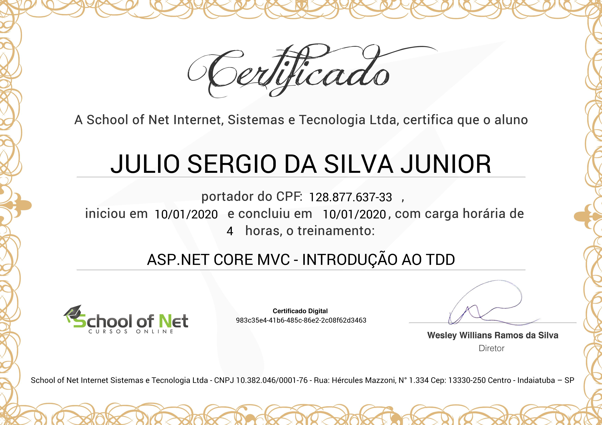

# ASP.NET Core MVC - Introdução ao TDD
## [School of Net](https://www.schoolofnet.com)

* ASP.NET Core MVC
* TDD

Instrutor: Anybal Rocha
"Este curso tem o objetivo de apresentar e estimular o aluno a desenvolver códigos a partir da implementação de testes no ASP.NET Core MVC. O TDD é uma técnica utilizada para guiar o desenvolvimento com base nos testes. Criamos o teste para uma função que ainda não foi desenvolvida e, apenas, após o teste desenvolvemos o código, propriamente dito. Ao final do desenvolvimento, teremos um sistema com 100% (ou muito próximo disso), de cobertura de testes. Essa técnica garante maior qualidade na entrega."

